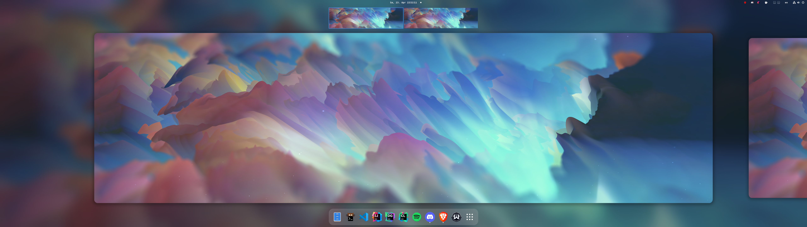
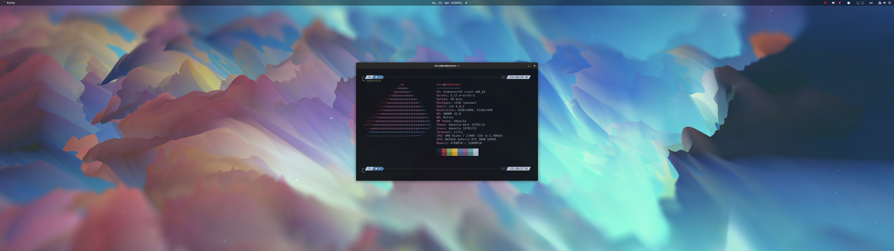
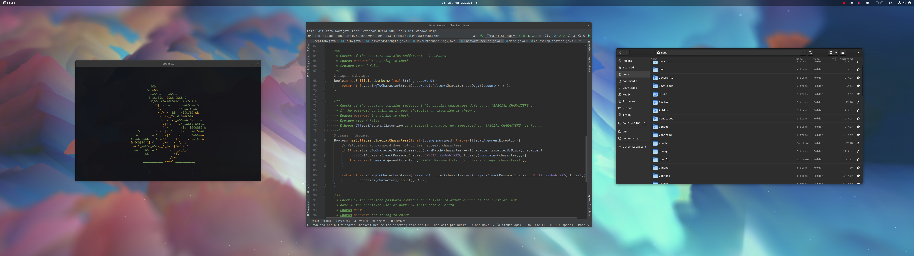
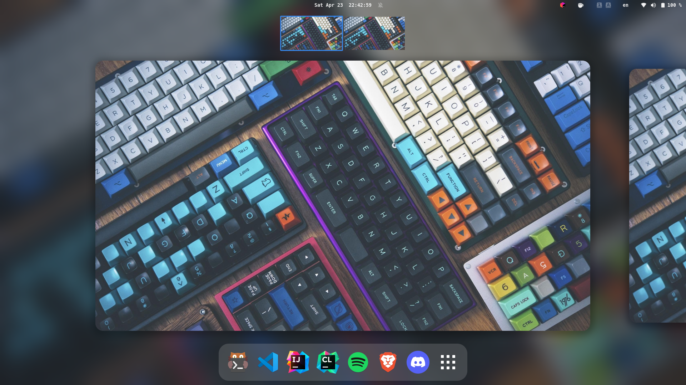
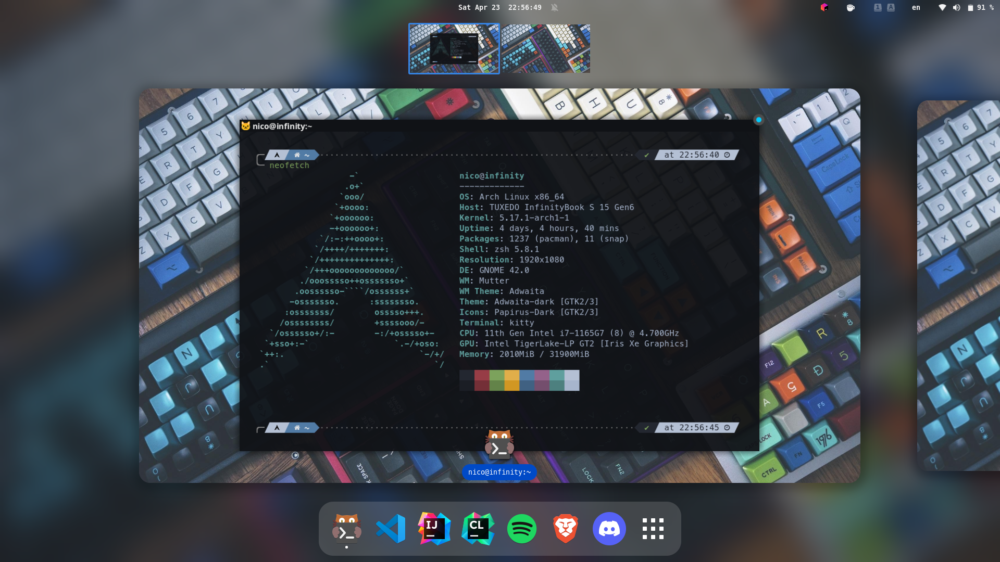
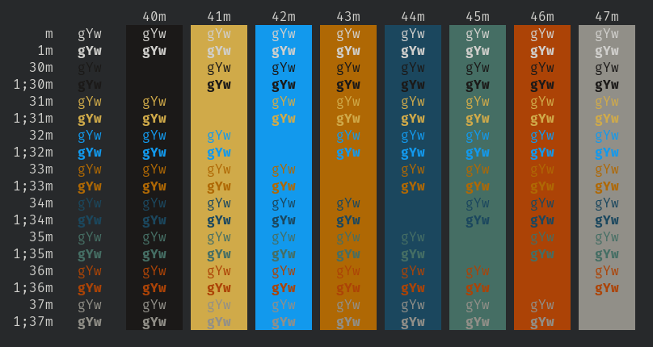

# dotfiles

The most awesome collection of `~/dotfiles` that can be found on entire GitHub! :p 
(preview screenshots of both desktop & laptop as well as my own terminal palette at the bottom!)

## details

|                   |                                                                                                |
| :---------------- | :--------------------------------------------------------------------------------------------- |
| OS                | [EndeavourOS](https://endeavouros.com/)                                                        |
| DE                | [GNOME](https://gnome.org/)                                                                    |
| GTK Theme         | [Adawaita Dark (GNOME default)](/)                                                             |
| Shell             | [Oh-My-ZSH](https://ohmyz.sh/)                                                                 |
| Shell Theme       | [Powerlevel10k](https://github.com/romkatv/powerlevel10k)                                      |
| Terminal Emulator | [Kitty](https://sw.kovidgoyal.net/kitty/)                                                      |
| Terminal Palette  | [my own theme - idk what to call it yet](.github/palette.png) |
| Icons             | [Adwaita (GNOME default)](/)                                                                   |
| Cursors           | [Material Light Cursors](https://www.gnome-look.org/p/1346778)                                 |

## gnome extensions

|                                                                                                                |
| :------------------------------------------------------------------------------------------------------------- |
| [Application Volume Mixer](https://extensions.gnome.org/extension/3499/application-volume-mixer/)              |
| [Blur My Shell](https://extensions.gnome.org/extension/3193/blur-my-shell/)                                    |
| [Caffeine](https://extensions.gnome.org/extension/517/caffeine/)                                               |
| [Gnome 4x UI Improvements](https://extensions.gnome.org/extension/4158/gnome-40-ui-improvements/)              |
| [Just Perfection](https://extensions.gnome.org/extension/3843/just-perfection/)                                |
| [Launch new instance](https://extensions.gnome.org/extension/600/launch-new-instance/)                         |
| [Lock Keys](https://extensions.gnome.org/extension/36/lock-keys/)                                              |
| [Rounded Windows Corner](https://extensions.gnome.org/extension/5237/rounded-window-corners/)                  |
| [Screenshot Directory](https://extensions.gnome.org/extension/4031/screenshot-directory/)                      |
| [Sound Input & Output Device Chooser](https://extensions.gnome.org/extension/906/sound-output-device-chooser/) |
| [Tray Icons: Reloaded](https://extensions.gnome.org/extension/2890/tray-icons-reloaded/)                       |
| [Unite](https://extensions.gnome.org/extension/1287/unite/)                                                    |
| [Useless Gaps](https://extensions.gnome.org/extension/4684/useless-gaps/)                                      |
| [User Themes](https://extensions.gnome.org/extension/19/user-themes/)                                          |
| [windowNavigator](https://extensions.gnome.org/extension/10/windownavigator/)                                  |

## preview - desktop

## preview - laptop

## My own terminal palette

