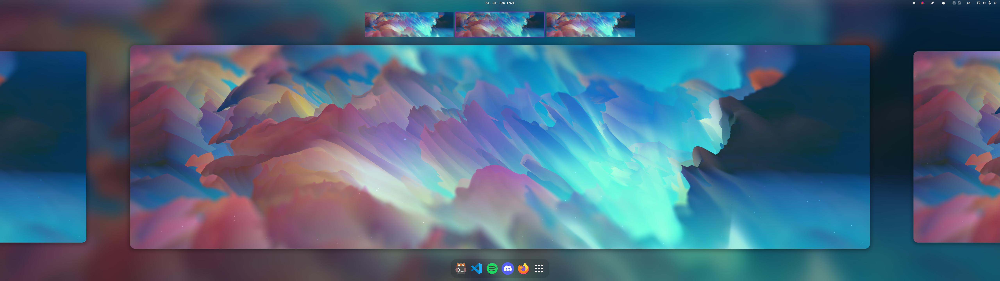
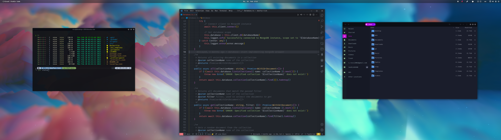

# dotfiles

The most awesome collection of dotfiles on entire GitHub :)

## details

|                  |                                                                  |
| :--------------- | :--------------------------------------------------------------- |
| OS               | [Manjaro Linux](https://manjaro.org/)                            |
| DE               | [Gnome](https://gnome.org/)                                      |
| GTK Theme        | [Sweet Dark v40](https://www.gnome-look.org/p/1253385/)          |
| Shell            | [Oh-My-ZSH](https://ohmyz.sh/)                                   |
| Shell Theme      | [Powerlevel10k](https://github.com/romkatv/powerlevel10k)        |
| Terminal         | [Kitty](https://sw.kovidgoyal.net/kitty/)                        |
| Terminal Palette | [Mountain Peek Night](https://github.com/nautilor/mountain-peek) |
| Icons            | [Papirus Dark](https://www.gnome-look.org/p/1166289/)            |
| Cursors          | [Material Light Cursors](https://www.gnome-look.org/p/1346778)   |

## preview

